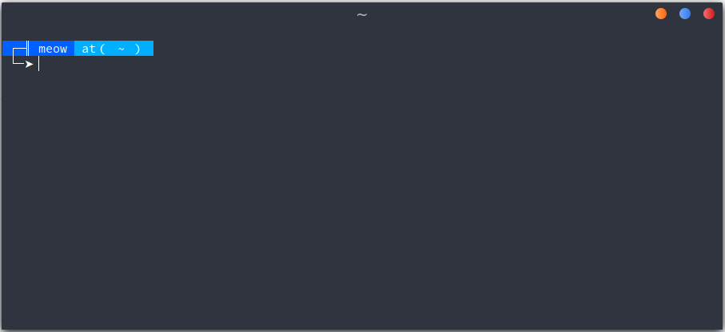
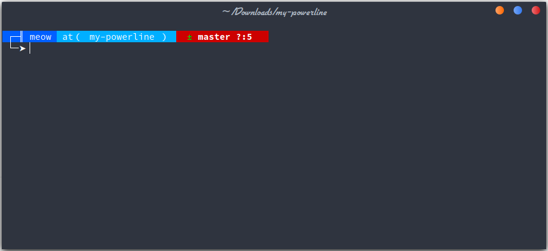

# Powerline Theme (Custom)

Customizing my terminal theme using powerline based on [bash-it](https://github.com/Bash-it/bash-it)

### Default Look

### Sudo Mode

### Git Additions

## How to use
* Install [bash-it](https://github.com/Bash-it/bash-it) on your computer.
* Put my-powerline into the `~/.bash_it/themes` directory.
* Open your modified config (`~/.bash_profile` or `~/.bashrc`).
* Set the theme `export BASH_IT_THEME='/home/{user}/.bash_it/themes/my-powerline/my-powerline.theme.bash'`
* Enjoy it
